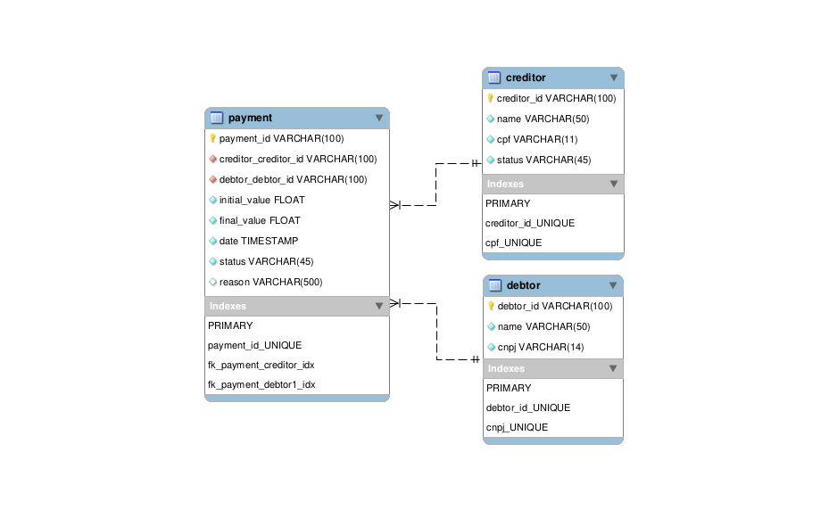

# Validate_Payment_Requests


[](https://github.com/GabrielFSSantos/Validate_Payment_Requests/blob/main/LICENSE)

<h1  align="center">
	
</h1>

> :wrench: Projeto criado para estudar e praticar conhecimentos de programação e teste de desenvolvimento realizado pela [Precato](https://github.com/precato). <br><br>

> :books: Validate_Payment_Requests vai lhe ajudar a validar solicitações de pagamentos, que passam por verificações para determinar se devem prosseguir adiante ou não. As solicitações inválidas são recusadas e vão para um local de consulta onde um usuário autenticado pode visualizar por qual motivo a solicitação foi recusada.<br><br>
> :man_technologist: Observação: o server foi projetado para testes, então não foi utilizado nenhum meio de autenticação e verificação de rotas, como também demais rotas de utilização criadas além da rota de criação de solicitações de pagamentos (host/payments/create) são utilizadas para realização de testes. Para utilização das rotas para testes pode ser utilizado o [Insomnia](https://insomnia.rest/) para realização de requests.<br><br>

## Requirements
>Ter instalado pelo menos um gerenciador de pacotes do Node, [Npm](https://www.npmjs.com/) ou [Yarn](https://yarnpkg.com/).
>Ter instalado banco de dados MySQL ou utilização do mesmo pelo [Free Remote MySQL](https://remotemysql.com/) que permite a utilização online. Após realizar o mesmo criar um arquivo <b>.env</b> na pasta raiz do projeto com as seguintes informações do banco:
```sh
PORT=<Porta onde o backend irá funcionar, sugestão: 3333>
DB_HOST=<Host do banco de dados para acesso ao mesmo>
DB_PORT=<Porta do banco de dados>
DB_NAME=<Nome do banco de dados>
DB_USER=<Usúario de acesso ao banco de dados>
DB_PASS=<Senha de acesso ao banco de dados>
```
>Para geração do banco de dados um arquivo SQL é disponibilizado junto ao código fonte ``src/assets/ValidatePaymentRequests.sql``

## Installing
>Executar na raiz do projeto o seguinte comando para instalar as dependências:
```sh
npm install
```
>ou
```sh
yarn install
```
## Use <a  name="usage"></a>
>Executar na raiz do projeto o seguinte comando para iniciar o projeto:
```sh
npm dev:server
```
>ou
```sh
yarn dev:server
```
>O projeto foi desenvolvido em TypeScript e seu funcionamento ocorrerá com o mesmo, caso queira passa-lo para Javascript e iniciar, execute na pasta raiz:
```sh
npm build
```
>ou
```sh
yarn build
```
>E logo após:
```sh
npm start
```
>ou
```sh
yarn start
```

## Contributing

> :information_desk_person: O projeto é de livre acesso e uso, então fique à-vontade para realizar um Fork e utilizar do mesmo, como também sugerir dicas e melhorias.

>

> 1. Faça um **fork** do projeto.

> 2. Crie uma nova branch com as suas alterações: `git checkout -b my-feature`

> 3. Salve as alterações e crie uma mensagem de commit contando o que você fez: `git commit -m "feature: My new feature"`

> 4. Envie as suas alterações: `git push origin my-feature`

> Caso tenha alguma dúvida confira este [guia de como contribuir no GitHub](https://github.com/firstcontributions/first-contributions)

  

## Tech

> :space_invader: Softwares e tecnologias utilizadas para o desenvolvimento e uso do projeto:

>

* [Node.js] - Ferramenta base utilizada para o desenvolvimento geral.

* [Typescript] - Ferramenta de tipagem utilizada para o desenvolvimento geral.

* [MySQL] - Banco de dados utilizado para registro de informações do mesmo.

* [VSCode] - Ótimo editor de texto.

* [StackEdit] - Excelente editor de Markdown online.

  

## License

[MIT License](https://github.com/GabrielFSSantos/Validate_Payment_Requests/blob/master/LICENSE)


[Node.js]: <https://nodejs.org/>

[Typescript]: <https://www.typescriptlang.org/>

[VSCode]: <https://code.visualstudio.com/>

[StackEdit]: <https://stackedit.io/>

[MySQL]:<https://www.mysql.com/>